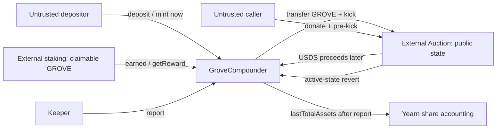
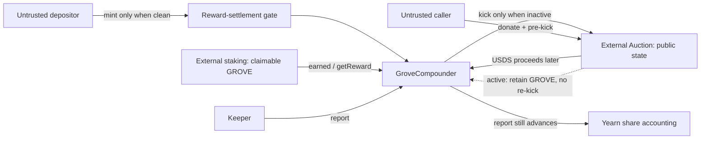
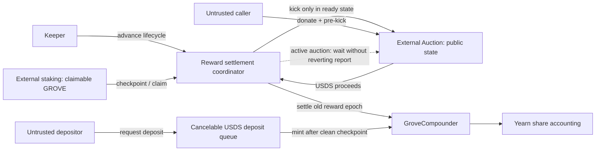

# Security Hardening Proposal: Own the reward-lifecycle boundary

## Decision

We need to choose how `GroveCompounder` coordinates share issuance and keeper
reporting while GROVE is claimable, held by the strategy, committed to an
auction, or converted to USDS but not yet reported. The decision is between a
focused set of local controls and a queued-deposit design that gives this
lifecycle an explicit coordinator.

## Executive Recommendation

The complete option set is:

- **Option 1: Focused lifecycle controls.** Make auction-mode reports
  idempotent when an auction is already active, and fail closed on new share
  issuance while a material old reward lot is unsettled.
- **Option 2: Queued settlement boundary.** Accept deposit requests into a
  cancelable USDS queue, drive rewards through an explicit settlement state
  machine, and mint shares only after the preceding reward epoch is clean.

I recommend Option 1 under the current constraints. It directly addresses the
report denial and gives the low-severity dilution path a conservative ownership
boundary without creating a second custody system. Option 2 becomes preferable
if the product must accept deposits continuously during long auction windows
and the team is willing to own queue fairness, cancellation, monitoring, and a
larger audit surface.

## Evidence

I inspected the affected strategy at the pinned revision and reopened the
report, auction, and deposit-admission boundaries rather than relying only on
captured snippets. The following IDs are defined here so later references stay
self-contained.

| Evidence | Finding or document | What it establishes |
| --- | --- | --- |
| `F-REPORT-DOS` | [`csf_caa09b28e81d6df8702f4f3b` — Active reward auction can block reports](../../findings/permissionless-auction-prekick-report-dos/permissionless-auction-prekick-report-dos.md) | `src/GroveCompounder.sol:107-109,174-180` unconditionally transfers and kicks; an externally active Auction makes the keeper report revert. |
| `F-REWARD-DILUTION` | [`csf_b51d06995c5b3b21d7a6c516` — Late deposits capture pre-entry reward value](../../findings/late-deposit-reward-dilution/late-deposit-reward-dilution.md) | `src/GroveCompounder.sol:70-72,84-118` leaves claimable and auction-pending rewards outside report-boundary share pricing. |
| `SOURCE-GROVE` | `GroveCompounder` at `f8f796d` | `availableDepositLimit()`, `_harvestAndReport()`, `_kickAuction()`, and `setAuction()` each enforce only a local fragment of the reward lifecycle. |

**Observed:** reward-bearing auction-mode reports call `_kickAuction()` without
first tolerating an active auction, and the strategy's reported total contains
only staked and idle USDS. **Observed:** deposit admission checks staking pause
and inherited allowlist/open policy, but not pending reward ownership.
**Inferred:** the common structural condition is not simply “two missing
checks.” The strategy lacks one owned representation of whether an old reward
lot is clean enough for a report to advance and for a new share cohort to enter.

## Current Design And Failure Mode

The depositor, keeper, staking contract, Auction, and Yearn accounting cross
three trust and lifetime boundaries. An untrusted depositor can request shares;
an untrusted caller can change public Auction state; and external staking plus
auction settlement move reward value over time. `GroveCompounder` nevertheless
treats report and deposit paths independently.

When a report claims an above-threshold GROVE balance, `_harvestAndReport()`
transfers it and immediately calls the Auction. If the Auction is already
active, a downstream revert aborts the entire privileged report. When a deposit
arrives before the reward lot becomes reported USDS, inherited share conversion
uses `lastTotalAssets`, so the enlarged supply later shares the old profit. The
same missing ownership boundary therefore affects availability on one path and
economic attribution on another.

The before view keeps each component at that level of abstraction:

[Mermaid source](../diagrams/own-reward-lifecycle-boundary-before.mmd)

The two dangerous edges are the active-state revert flowing into report and
the immediate mint occurring before ownership of pending rewards is resolved.
Withdrawals are not shown because neither finding established that they fail;
both options preserve them as a non-negotiable escape path.

## Desired Invariants

- A keeper report advances accounting even when the configured reward Auction
  is already active; optional reward sale work cannot make reporting depend on
  an untrusted public kick race.
- GROVE is transferred to the Auction only when the strategy has established
  that a new auction can start; otherwise the balance remains recoverable in
  the strategy.
- New shares are not minted against a reported asset total that excludes a
  material reward lot earned by the existing supply.
- Each unsettled reward state has one explicit recovery transition, maximum
  expected duration, and observable reason when it blocks share issuance.
- Principal withdrawals remain available throughout delayed reward settlement.

## Constraints And Non-Goals

We preserve the existing staking contract, reward token, Auction integration,
Yearn tokenized-strategy interface, keeper/management roles, and shutdown
recovery. No measured gas, latency, or memory budget was supplied, so all
resource claims below are source-derived or hypothetical and carry validation
plans. We do not redesign the APR oracle, replace reward-price discovery,
guarantee immediate auction settlement, or treat public-kick restriction as a
complete fix: ordinary report-to-report collisions still exist.

## Before Architecture

The [before diagram](../diagrams/own-reward-lifecycle-boundary-before.mmd)
shows no strategy-owned lifecycle control between the two untrusted entry
points and the report/share-accounting sinks. The Auction owns its active flag,
staking owns accrued GROVE, and Yearn owns reported assets, but no component
answers the combined question “may a report proceed, and may this share cohort
enter, given the current reward lot?” That is the boundary both options change.

## Options

### Option 1: Focused lifecycle controls

This option keeps the current contracts and synchronous deposit API. We add an
owned predicate for material unsettled reward state and use it in two places.
First, `_harvestAndReport()` checks Auction activity before any transfer; an
active auction causes reward sale to be deferred while the report continues.
Second, `availableDepositLimit()` returns zero while a pre-entry reward lot is
material and unsettled. A keeper checkpoint or completed auction/report clears
the gate. Withdrawals remain independent.

The attractive part is proportionality. We do not add a price oracle for GROVE,
custody a pending deposit, or alter the shape of Yearn shares. The report fix is
idempotent under the exact external state that currently reverts, while the
deposit gate makes the economic policy explicit: old rewards settle before a
new cohort mints. We should be honest, however, that “material” needs a careful
definition across claimable GROVE, strategy-held GROVE, active-auction
inventory, and returned-but-unreported USDS. Raw token balance alone would let
a dust donor hold deposits closed; the predicate needs thresholds, trusted
queries, and an operator escape path.

[Mermaid source](../diagrams/own-reward-lifecycle-boundary-local-controls-after.mmd)

| Change | Before | After | Security consequence | Cost |
| --- | --- | --- | --- | --- |
| Auction collision handling | Transfer then unconditional `kick()` | Check active state; retain GROVE and continue report | Removes the active-auction revert from the report path | One external view and an extra branch on reward-bearing reports |
| Deposit admission | Open/allowlist and staking-pause checks only | Also require a clean material reward state | Prevents stale-priced new shares from sharing an old material lot | Deposits can pause through accrual and settlement |
| Recovery | Informal keeper/management timing | Explicit cleanup reason and recovery transition | Makes prolonged gates diagnosable and bounded | New events, monitoring, and runbook |

The principal residual risk is control drift: checks remain distributed between
report and admission functions. A future reward path could omit the predicate.
Rollout is nevertheless straightforward: deploy the focused logic, keep open
deposits disabled during migration, run the original PoCs, then reopen only
after a clean-state checkpoint. Rollback can return to closed deposits and the
prior implementation without moving queued user funds because this option has
no queue.

### Option 2: Queued settlement boundary

This option separates accepting USDS from issuing strategy shares. A small,
explicit coordinator records the reward lifecycle and a cancelable queue holds
deposit requests. If an old reward lot is unsettled, users may still submit or
cancel USDS requests, but no Yearn shares mint. The coordinator advances the
old lot through checkpoint, claim, auction, proceeds, and report states; only a
clean checkpoint releases the queued batch for share minting at the resulting
price.

The strongest case for this design is product availability without stale
pricing. We no longer need to choose between immediately rejecting a deposit
and minting it into an unresolved reward epoch. Reports are also state-machine
transitions: an active Auction is a waiting state, not an exception. A single
boundary can emit state, age, and reason, making keeper recovery and incident
response materially clearer than several implicit balance checks.

What gives me pause is the authority and custody we would create. The queue
must define ordering, batch price, cancellation, receiver identity, maximum
delay, shutdown behavior, and what happens if USDS has nonstandard transfer
behavior. The coordinator becomes a new component whose state must agree with
the external Auction despite public calls. It improves isolation, but it does
not make Auction liveness trustworthy; delayed settlement still delays share
activation. Memory/storage grows with queued requests unless requests are
aggregated carefully, and each activation adds transactions and keeper work.

[Mermaid source](../diagrams/own-reward-lifecycle-boundary-queued-settlement-after.mmd)

| Change | Before | After | Security consequence | Cost |
| --- | --- | --- | --- | --- |
| Deposit intake | Transfer and mint synchronously | Escrow request, then mint after a clean checkpoint | Prevents pending old rewards from reaching a new share cohort while retaining intake | New custody, cancellation, and delayed-finality semantics |
| Reward control | Balance and external state interpreted ad hoc | Explicit coordinator state and allowed transitions | Centralizes collision handling and recovery ownership | Larger state machine and audit surface |
| Auction wait | Revert propagates into report | Active auction is a non-reverting waiting state | Removes public active state as report-denial sink | Keeper must revisit and monitor waiting epochs |
| Failure containment | Strategy call atomically succeeds or reverts | Queue funds stay cancelable while settlement is delayed | Separates reward liveness from depositor principal | More contracts/storage and operational procedures |

Adoption should begin closed to new public requests, with shadow state derived
from the existing strategy and adversarial transition tests before custody is
enabled. A capped pilot queue can then validate cancellation, batching, and
maximum delay. Rollback must always permit users to cancel unactivated
requests, disable new intake, and let already-active strategy shares continue
under the old strategy path. I would be comfortable recommending this option
only after the team supplies an always-open requirement and accepts an
independent review of the new custody state machine.

## Comparison

The table is a compact second view; it does not substitute for the mechanisms
above. Option 1 is cheaper because it sometimes refuses share issuance. Option
2 pays storage and operational complexity to preserve deposit request
availability while keeping minting behind settlement.

| Dimension | Option 1: focused controls | Option 2: queued boundary |
| --- | --- | --- |
| Security | Improves both paths; residual drift and gate-griefing risk | Stronger centralized transition ownership; adds queue/custody attack surface |
| Performance | One or more view checks on relevant calls | Extra request and activation transactions; batching-dependent |
| Memory / storage | A few state values/events | Per-request or aggregate queue state and lifecycle history |
| Reliability | Reports continue; deposits may be temporarily unavailable | Intake and settlement isolated, but activation depends on coordinator/keeper progress |
| Operability | Modest new alerts and cleanup runbook | New queue age, cancellations, batches, stuck states, and recovery procedures |
| Migration | Focused contract upgrade/deployment and PoC regression | New component, interface/UX changes, pilot, and independent audit |
| Reversibility | High; close deposits and revert focused logic | Medium; queued funds must drain or cancel before removal |

None of these effects was benchmarked. Option 1 should be compared against the
current reward-bearing report and deposit gas. Option 2 needs end-to-end
request-to-activation latency, per-request storage, keeper transaction count,
and cancellation gas under representative batches. A decision threshold should
be agreed before implementation; absent a supplied budget, we should not
pretend either option has a measured cost advantage beyond its obvious call and
storage structure.

## Recommendation

I recommend Option 1 because the validated portfolio contains one Medium
availability issue and one constrained Low economic issue, while the existing
strategy already supports closing deposits. Focused controls provide a direct
security effect with lower compatibility and custody risk. We should implement
the predicate as a named lifecycle policy, not scattered magic balance checks,
and document when management may override it during shutdown.

Option 2 should win if immediate deposit request intake through long reward
settlement windows is non-negotiable, if those windows are frequent enough to
make Option 1 operationally unacceptable, or if future strategies will reuse
the coordinator across multiple reward routes. Evidence of repeated lifecycle
bugs across that wider portfolio would also strengthen the structural case.

## Evidence Coverage And Residual Risk

| Evidence | Option 1 effect | Option 2 effect | Tactical fix still required |
| --- | --- | --- | --- |
| `F-REPORT-DOS` — Active reward auction can block reports | Addresses by skipping transfer/kick while active and continuing report | Addresses by representing active Auction as a non-reverting waiting state | Yes, until either design is deployed and the original pre-kick PoC passes as a negative test |
| `F-REWARD-DILUTION` — Late deposits capture pre-entry reward value | Addresses for material lots by blocking share minting until clean; dust/materiality policy remains | Addresses by activating queued deposits only after the old epoch settles | Yes, including cohort fuzz tests across claimable, held, auctioned, returned, reported, and unlocked states |

Both options retain external Auction liveness risk and reward-price risk. Option
1 can reduce deposit availability; Option 2 can delay queued activation. Neither
proposal proves the correctness of unvalidated deployed configurations, and
neither should be described as closing a finding before implementation and
revalidation.

## Migration And Rollout

For Option 1, keep deposits closed, deploy or upgrade the strategy logic, and
checkpoint existing rewards. Exercise active-auction, no-auction, sub-threshold,
direct-swap, shutdown, and withdrawal states before reopening. Enable alerts for
report completion, active-auction deferrals, gate age, and gate reason. Roll
back by closing deposits and returning to the prior implementation only if the
report path and withdrawals remain safe.

For Option 2, first deploy the coordinator and queue with intake disabled.
Shadow the lifecycle against live read-only state, then run a capped pilot with
cancelability and a strict maximum activation delay. Never migrate existing
shares into the queue. On rollback, disable new requests, let users cancel, and
drain all pending USDS before retiring the component.

## Validation Plan

- Re-run the one-wei pre-kick and normal two-report collision tests; every
  report must advance while the active lot remains unchanged and recoverable.
- Accrue a reward lot, attempt a late deposit in every lifecycle state, settle
  and unlock, and assert that new shares receive none of the pre-entry lot.
- Fuzz reward size, deposit size, threshold, fee, auction timing, public dust
  donations, partial takes, settlement delay, and shutdown transitions.
- Assert that no reward-state gate blocks principal withdrawal or emergency
  withdrawal.
- Benchmark current versus Option 1 report/deposit gas on no-reward,
  sub-threshold, active-auction, and clean-settlement paths.
- If Option 2 is selected, measure per-request storage, activation/cancellation
  gas, batch throughput, and request-to-activation latency against agreed caps.
- Test monitoring and runbook recovery from a stale Auction, a failed keeper,
  a paused staking contract, and an intentionally closed strategy.

## Implementation Work Packages

No implementation is authorized by this proposal. If Option 1 is selected, the
work divides naturally into a named reward-state predicate, idempotent auction
handling, deposit-gate integration, observability/recovery, and PoC plus fuzz
regressions. Acceptance requires negative reproduction of both findings and
unchanged withdrawal behavior.

If Option 2 is selected, design review must first freeze queue custody,
ordering, cancellation, activation-price, keeper, maximum-delay, shutdown, and
upgrade invariants. Implementation should then separate the queue, coordinator,
strategy adapter, monitoring, migration, and independent security review into
reviewable packages.

## Open Questions

- Must the product accept deposit requests continuously, or is bounded
  fail-closed admission acceptable while material rewards settle?
- What materiality unit and threshold can resist dust griefing without allowing
  economically meaningful reward dilution?
- Can the configured Auction expose a reliable active/inventory view for every
  supported deployment, and what is the maximum supported settlement age?
- Should shutdown bypass only deposit gating, or also reward settlement work,
  while preserving unrestricted principal recovery?
- What monitoring and escalation threshold should apply to deferred reward
  sales and stale deposit gates?
